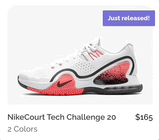
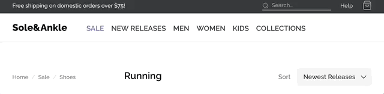
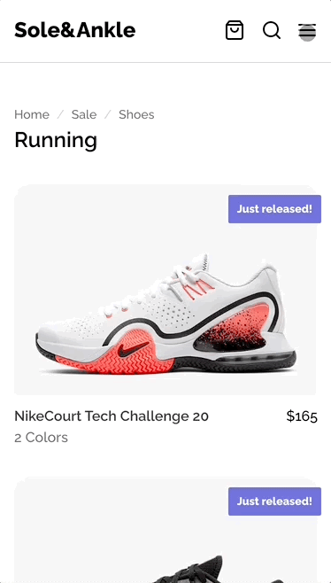

# Sole&Ankle, Animated — Module 8 workshop

Once again, we're working on the sneaker store!

In this workshop, we're going to use our newly-acquired animation skills to breathe some life into this application.

**Some parts of this workshop are unguided.** Each exercise will challenge you to go beyond the stated goal, to come up with your own twist on the interaction.

Also, **don't forget about accessibility.** Significant motion should be disabled by default, and only enabled based on the `prefers-reduced-motion` media query.

---

## Exercise 1: Sneaker Zoom

Add a hover/focus interaction to the sneakers so that the image zooms in slightly:

This might seem like a small task, but there are lots of little details that make it tricky. Pay close attention to the GIF. Some things to watch out for:

- The enter transition should be faster than the exit transition
- The "flags" for new releases and sales should hang over the edge of the photo, as they do initially.
- The corners should remain perfectly round at all times.
- The shoes aren't centered within the photos, so if you zoom into the center of the photo, the shoe will appear to drop lower. Tweak the animation so that it zooms in on the shoe.

The relevant component is `ShoeCard.js`.

### Stretch Goal

Once you've matched the GIF above, it's time to get creative. Change or extend the animation. Experiment with different techniques and properties!

Here are some ideas:

- In addition to the photo zoom, tweak the new/sale flags in some way.
- Use a CSS filter on the photo.
- Use a 3D transform on the entire ShoeCard component, rotating in 3D space.

---

## Exercise 2: Navigation link flip-up

When hovering over the navigation links on desktop, they should "flip up", revealing a bold copy underneath:

In order to accomplish this challenge, **you'll need to tweak the JSX.** There's no way to solve this problem in CSS alone. In particular, you'll need to duplicate the text inside each navigation link.

The relevant component is `Header.js`. You may wish to create a new `NavLink` component, though it isn't required.

### Stretch Goal

Here's a list of over a dozen link hover animations: https://tympanus.net/Development/CreativeLinkEffects/

Try and implement another effect from the list!

---

## Exercise 3: Modal enter animation

On mobile, add the following animations to the hamburger menu:

This effect consists of 3 individual animations:

1. The backdrop fades in.
2. The drawer slides in from the right.
3. The drawer's contents fade in.

For bonus points, use a custom easing curve on the slide-in animation. You can configure one using this tool: https://cubic-bezier.com.

Don't worry about the exit animation; exit animations are difficult in React, and require a library like [React transition group](https://reactcommunity.org/react-transition-group/).

The relevant component is `MobileMenu.js`.

### Stretch Goal

Here are some ideas:

- Experiment with different orchestrations, animating different elements at different times
- Use a 3D transform on the drawer so that it swings in like a door closing rather than sliding in from offscreen
- Instead of fading in all of the drawer's contents at once, add a staggered fade to the individual navigation links so that they fade in one by one, from the top down
